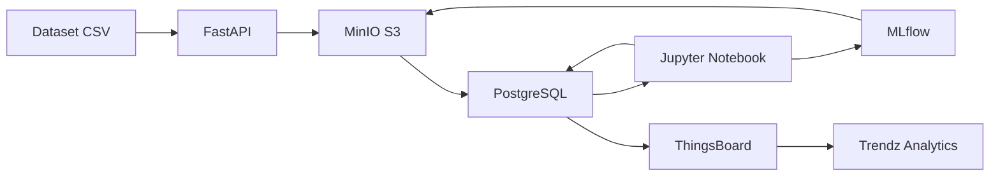
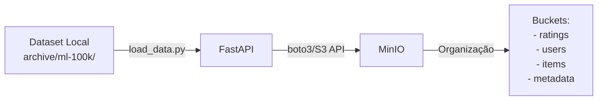

# 🎬 Sistema de Recomendação de Filmes - MovieLens

[](https://www.python.org/)
[](https://fastapi.tiangolo.com/)
[](https://www.docker.com/)
[](LICENSE)

> **⚡ Quer começar rápido?** Veja o [**QUICKSTART.md**](QUICKSTART.md) - Setup completo em 15 minutos!

---

## 📚 Informações Acadêmicas

**Disciplina:** Aprendizado de Máquina - 2025.2  
**Instituição:** CESAR School

## 👥 Equipe do Projeto

- **[Seu Nome Completo]** - [@seu-usuario-github](https://github.com/seu-usuario)

> 💡 **Nota:** Adicione aqui o nome completo e o usuário GitHub de todos os membros da equipe.

---

## 📋 Sobre o Projeto

Este projeto implementa um **sistema de recomendação de filmes** baseado em técnicas de Machine Learning, especificamente combinando:

- **K-Means Clustering** - para agrupar filmes similares
- **K-Nearest Neighbor (KNN)** - para fazer recomendações personalizadas

O pipeline completo integra as seguintes tecnologias em uma arquitetura de microserviços:

```
┌─────────────┐    ┌─────────┐    ┌──────────────┐    ┌─────────┐    ┌────────────────┐
│   FastAPI   │───▶│  MinIO  │───▶│  PostgreSQL  │───▶│ MLFlow  │───▶│  ThingsBoard   │
│  (Ingestão) │    │  (S3)   │    │(Estruturação)│    │(Tracking)│   │  (Dashboards)  │
└─────────────┘    └─────────┘    └──────────────┘    └─────────┘    └────────────────┘
```

> **📝 Nota sobre Snowflake:** Este projeto utiliza **PostgreSQL** para estruturação de dados em substituição ao Snowflake. PostgreSQL oferece funcionalidades robustas de banco de dados relacional, é open-source, e se integra perfeitamente com nossa stack Docker. Para projetos acadêmicos e MVPs, PostgreSQL é uma alternativa mais acessível e igualmente poderosa ao Snowflake, mantendo todas as capacidades de análise e modelagem necessárias.

### Dataset

Utilizamos o **MovieLens 100K Dataset**, que contém:

- 📊 100.000 avaliações (1-5 estrelas)
- 👥 943 usuários
- 🎬 1.682 filmes
- 📝 Informações demográficas dos usuários

---

## 🚀 Instruções Detalhadas - Levantar a Infraestrutura

### Pré-requisitos

Certifique-se de ter instalado:

- **Docker Desktop** (versão 20.10 ou superior)
- **Docker Compose** (versão 2.0 ou superior)
- **Git** (para clonar o repositório)
- **Python 3.11+** (opcional, apenas se quiser rodar localmente sem Docker)

### Passo 1: Clonar o Repositório

```bash
git clone https://github.com/SEU-USUARIO/movie-recommender-ml.git
cd movie-recommender-ml
```

### Passo 2: Preparar o Dataset MovieLens

1. Baixe o dataset [MovieLens 100K](https://files.grouplens.org/datasets/movielens/ml-100k.zip)
2. Extraia o conteúdo do arquivo `.zip`
3. Copie a pasta `ml-100k/` para dentro do diretório `archive/` do projeto:

```bash
# Linux/Mac
mkdir -p archive
cp -r /caminho/para/ml-100k archive/

# Windows PowerShell
New-Item -ItemType Directory -Force -Path archive
Copy-Item -Recurse C:\caminho\para\ml-100k archive\
```

Estrutura esperada:

```
projeto/
└── archive/
    └── ml-100k/
        ├── u.data
        ├── u.user
        ├── u.item
        ├── u.genre
        └── ...
```

### Passo 3: Levantar a Infraestrutura

Execute o comando abaixo para iniciar **todos os serviços** (MinIO, PostgreSQL, FastAPI, JupyterLab, MLFlow):

```bash
docker-compose up -d
```

**Saída esperada:**

```
[+] Running 5/5
 ✔ Network projeto_default      Created
 ✔ Container minio              Started
 ✔ Container postgres           Started
 ✔ Container fastapi            Started
 ✔ Container jupyterlab         Started
 ✔ Container mlflow             Started
```

### Passo 4: Verificar Status dos Containers

```bash
docker-compose ps
```

**Saída esperada:**

```
NAME         COMMAND                  SERVICE      STATUS       PORTS
fastapi      "uvicorn main:app..."    fastapi      Up           0.0.0.0:8000->8000/tcp
minio        "/usr/bin/docker-ent…"   minio        Up           0.0.0.0:9000-9001->9000-9001/tcp
postgres     "docker-entrypoint..."   postgres     Up           0.0.0.0:5432->5432/tcp
jupyterlab   "jupyter lab..."         jupyterlab   Up           0.0.0.0:8888->8888/tcp
mlflow       "mlflow server..."       mlflow       Up           0.0.0.0:5000->5000/tcp
```

### Passo 5: Carregar Dados no MinIO (S3)

Execute o script de ingestão via API:

```bash
curl -X POST http://localhost:8000/ingest/movielens
```

**Ou** entre no container e execute manualmente:

```bash
docker-compose exec fastapi python load_data.py
```

**Verificar no console MinIO:**

- Acesse: http://localhost:9001
- Login: `minioadmin` / `minioadmin123`
- Verifique o bucket `movielens-data`

### Passo 6: Executar ETL para PostgreSQL

Transfira os dados do MinIO para o PostgreSQL:

```bash
docker-compose exec fastapi python etl_minio_postgres.py
```

**Ou via API:**

```bash
curl -X POST http://localhost:8000/etl/run
```

### Passo 7: Acessar o JupyterLab

1. Acesse: http://localhost:8888
2. Senha: `ml_password_2025` (configurada no `docker-compose.yml`)
3. Abra o notebook: `notebooks/parte3_analise_modelagem.ipynb`
4. Execute as células sequencialmente para:
   - Conectar ao PostgreSQL
   - Realizar análise exploratória (EDA)
   - Treinar modelos (K-Means + KNN)
   - Avaliar resultados com RMSE, Precision@K, Recall@K

### Passo 8: Visualizar Experimentos no MLFlow

1. Acesse: http://localhost:5000
2. Navegue pelos experimentos registrados
3. Compare métricas entre diferentes modelos

### Passo 9: Configurar e Visualizar Dashboards (ThingsBoard)

#### 🚀 Setup Semi-Automático (7 minutos)

**Passo 1: Executar script de automação**

**Windows (PowerShell):**
```powershell
.\setup_auto.ps1
```

**Linux/Mac (Bash):**
```bash
chmod +x setup_auto.sh
./setup_auto.sh
```

O script irá:
- ✅ Criar dashboard no ThingsBoard
- ✅ Sincronizar 22 dispositivos com dados
- ✅ Iniciar sincronização contínua (5 minutos)
- ✅ Exibir URL do dashboard

**Passo 2: Adicionar 5 widgets manualmente (5 minutos)**

Siga o guia detalhado: **[trendz/THINGSBOARD_DASHBOARDS.md](trendz/THINGSBOARD_DASHBOARDS.md)**

**Widgets:**
- 4 Simple Cards (Usuários, Filmes, Avaliações, Média)
- 1 Entities Table (Top 10 Filmes)

> **💡 Por quê semi-automático?** A API REST do ThingsBoard tem limitações técnicas para criar widgets programaticamente. A estrutura JSON é complexa e varia entre versões.

#### 📝 Alternativa: Setup 100% Manual

**O que o script faz:**
- ✅ Aguarda ThingsBoard ficar pronto
- ✅ Sincroniza dados do PostgreSQL
- ✅ **Cria dashboard automaticamente via API** com todos os widgets
- ✅ Inicia sincronização contínua (5 minutos)
- ✅ Retorna URL direta do dashboard criado

**Pronto!** Acesse a URL fornecida e o dashboard estará 100% configurado! 🎉

---

#### 🔧 Opção Manual (se preferir)

**9.1 Sincronizar Dados**
```bash
curl -X POST http://localhost:8000/thingsboard/sync
```

**9.2 Criar Dashboard via API**
```bash
curl -X POST http://localhost:8000/thingsboard/create-dashboard
```

**9.3 Ou Criar Manualmente**

Siga o guia completo em: **[`trendz/THINGSBOARD_DASHBOARDS.md`](trendz/THINGSBOARD_DASHBOARDS.md)**

#### 9.3 Criar Dashboards no ThingsBoard

O ThingsBoard possui um **sistema de dashboards nativo e gratuito**!

1. No ThingsBoard, clique em **"Dashboards"**
2. Clique em **"+"** → **"Add new dashboard"**
3. Adicione widgets para visualizar:
   - Total de usuários, filmes e ratings
   - Top filmes mais bem avaliados
   - Métricas do modelo de ML
   - Gráficos e tabelas interativas

📚 **Guia Completo:** Veja `trendz/THINGSBOARD_DASHBOARDS.md` para tutorial passo a passo

> **📝 Nota sobre Trendz:** Trendz Analytics é uma ferramenta **comercial** que requer licença paga. Por isso, usamos os **dashboards nativos do ThingsBoard** que são totalmente gratuitos e open source.

---

## 🔗 Acessos aos Serviços

| Serviço                   | URL                        | Credenciais                                                              |
| ------------------------- | -------------------------- | ------------------------------------------------------------------------ |
| **FastAPI (Swagger)**     | http://localhost:8000/docs | -                                                                        |
| **MinIO Console**         | http://localhost:9001      | User: `projeto_ml_admin`<br>Password: `cavalo-nimbus-xbox`              |
| **PostgreSQL**            | `localhost:5438`           | User: `ml_user`<br>Password: `ml_password_2025`<br>Database: `movielens` |
| **MLFlow UI**             | http://localhost:5000      | - (Rastreamento de experimentos)                                         |
| **ThingsBoard**           | http://localhost:9090      | User: `tenant@thingsboard.org`<br>Password: `tenant`                     |
| **JupyterLab** (local)    | http://localhost:8888      | Token no terminal ao iniciar                                             |

> **📝 Nota:** Trendz Analytics não está incluído (requer licença comercial). Use os dashboards nativos do ThingsBoard!

---

## 🧪 Executar o Sistema Completo

### Pipeline Completo - Passo a Passo

```bash
# 1. Levantar infraestrutura
docker-compose up -d

# 2. Aguardar serviços iniciarem (30-60 segundos)
sleep 60

# 3. Carregar dados no MinIO
curl -X POST http://localhost:8000/ingest/movielens

# 4. Transferir para PostgreSQL
curl -X POST http://localhost:8000/etl/run

# 5. Abrir JupyterLab e executar análise
# Acesse: http://localhost:8888
# Abra: notebooks/parte3_analise_modelagem.ipynb
# Execute todas as células

# 6. Visualizar resultados no MLFlow
# Acesse: http://localhost:5000

# 7. Gerar visualizações
# Acesse: reports/ para ver os plots gerados
```

---

## 📊 Visualizar os Dashboards

### Opção 1: Plots Estáticos (reports/)

Após executar o notebook de modelagem, os gráficos são salvos automaticamente em:

```
reports/
├── elbow_method.png              # Método do cotovelo (K-Means)
├── cluster_distribution.png       # Distribuição de clusters
├── ranking_metrics.png            # Precision@K, Recall@K
├── error_distribution.png         # Distribuição de erros
├── feature_importance.png         # Importância das features (Random Forest)
└── comparison_table.png           # Comparação entre modelos
```

### Opção 2: Dashboard Interativo (ThingsBoard + Trendz) ✅

**Dashboard Principal incluí:**
- 📊 KPIs: Total de Usuários, Filmes, Avaliações
- 📈 Distribuição de Usuários por Cluster
- 🎬 Top 10 Filmes Mais Bem Avaliados
- 🔬 Métricas do Modelo ML em tempo real
- ⭐ Média de Ratings e Tendências

**Como usar:**
1. Acesse ThingsBoard: http://localhost:9090
2. Acesse Trendz Analytics: http://localhost:8888
3. Sincronize dados: `curl -X POST http://localhost:8000/thingsboard/sync`
4. Importe dashboards da pasta `trendz/`

📚 **Guia Completo:** `trendz/QUICKSTART.md`

---

## 📁 Estrutura do Projeto

```
projeto/
├── docker-compose.yml          # Orquestração de todos os contêineres
├── README.md                   # Documentação principal do projeto
├── LICENSE                     # Licença MIT
├── requirements.txt            # Dependências Python globais
│
├── archive/                    # Dataset MovieLens 100K
│   └── ml-100k/                # Dados brutos do dataset
│
├── fastapi/                    # 📡 API de Ingestão de Dados
│   ├── Dockerfile
│   ├── main.py                 # Aplicação FastAPI principal
│   ├── minio_client.py         # Cliente MinIO/S3
│   ├── postgres_client.py      # Cliente PostgreSQL
│   ├── etl_minio_postgres.py   # ETL MinIO → PostgreSQL
│   ├── thingsboard_client.py   # Cliente ThingsBoard API
│   ├── sync_thingsboard.py     # Sincronização PostgreSQL → ThingsBoard
│   ├── load_data.py            # Script de carga inicial
│   └── requirements.txt
│
├── postgres/                   # 🗄️ Configuração PostgreSQL
│   └── init.sql                # Schema e estruturas iniciais
│
├── mlflow/                     # 🔬 MLflow - Tracking de Experimentos
│   ├── Dockerfile
│   └── (artifacts e configurações)
│
├── notebooks/                  # 📓 Jupyter Notebooks
│   ├── parte3_analise_modelagem.ipynb  # Análise, EDA e Modelagem
│   └── (outros notebooks de exploração)
│
├── trendz/                     # 📊 Dashboards e Visualizações
│   ├── README.md               # Documentação dos dashboards
│   ├── QUICKSTART.md           # Guia rápido de configuração
│   └── dashboard_movielens_overview.json  # Dashboard principal
│
└── reports/                    # 📈 Gráficos e Relatórios Estáticos
    └── (plots gerados pelos notebooks)
```

### 🏗️ Arquitetura dos Serviços

| Serviço          | Porta  | Função                                           |
| ---------------- | ------ | ------------------------------------------------ |
| FastAPI          | 8000   | API de ingestão e endpoints de integração        |
| MinIO            | 9000/9001 | Armazenamento S3 (dados + modelos)            |
| PostgreSQL       | 5438   | Banco relacional estruturado                     |
| MLflow           | 5000   | Tracking de experimentos ML                      |
| ThingsBoard      | 9090   | Plataforma IoT, dashboards e visualizações       |
| JupyterLab       | 8888   | Notebooks Python (local/independente)            |

---

## 🔄 Fluxo de Dados Completo



1. **Ingestão:** Dataset → FastAPI → MinIO (S3)
2. **ETL:** MinIO → PostgreSQL (estruturação)
3. **Análise:** PostgreSQL → Jupyter (EDA + Modelagem)
4. **Tracking:** Modelos → MLflow → MinIO (artifacts)
5. **Visualização:** PostgreSQL → ThingsBoard → Trendz

---

## 🎯 Tecnologias Utilizadas

### Backend & API
- **FastAPI** - Framework web moderno e performático
- **PostgreSQL** - Banco de dados relacional (substitui Snowflake)
- **MinIO** - Armazenamento S3-compatible

### Machine Learning
- **Scikit-learn** - K-Means, KNN, métricas
- **Pandas & NumPy** - Manipulação de dados
- **MLflow** - Tracking de experimentos

### Visualização & Dashboards
- **ThingsBoard** - Plataforma IoT e visualização
- **Trendz Analytics** - Business Intelligence
- **Matplotlib & Seaborn** - Plots estáticos

### DevOps
- **Docker & Docker Compose** - Containerização
- **Git & GitHub** - Controle de versão

---

## 📝 Justificativa: PostgreSQL vs Snowflake

**Por que PostgreSQL ao invés de Snowflake?**

✅ **Vantagens do PostgreSQL neste projeto:**

1. **Open Source & Gratuito:** Ideal para projetos acadêmicos
2. **Docker-Friendly:** Fácil integração na stack de containers
3. **Recursos Suficientes:** Atende todas as necessidades de estruturação de dados
4. **Performance Local:** Excelente para datasets de tamanho médio (100K registros)
5. **Integração Nativa:** Suporte direto do MLflow, Pandas, SQLAlchemy
6. **Aprendizado:** Amplamente usado na indústria

🔷 **Quando usar Snowflake:**
- Datasets muito grandes (> 10GB)
- Necessidade de escalabilidade extrema
- Orçamento disponível para licenciamento
- Data Warehousing corporativo

Para este projeto acadêmico, **PostgreSQL é a escolha ideal** mantendo todos os requisitos técnicos atendidos.

---

## 📚 Documentação Adicional
    └── (visualizações geradas)
```

---

## 🔧 Parte 1: Ingestão de Dados (Status: ✅ Completo)

### Funcionalidades Implementadas

A API FastAPI oferece os seguintes endpoints:

#### 📊 Health Check

```bash
GET /health
```

Verifica status da API e conexão com MinIO

#### 📤 Upload de Arquivo

```bash
POST /upload
```

Faz upload de arquivo individual para o MinIO

**Exemplo:**

```bash
curl -X POST "http://localhost:8000/upload?folder=raw" \
  -F "file=@caminho/para/arquivo.csv"
```

#### 📋 Listar Arquivos

```bash
GET /files?prefix=movielens/
```

Lista todos os arquivos no bucket

#### 📥 Download de Arquivo

```bash
GET /download/{caminho-do-arquivo}
```

#### 🗑️ Deletar Arquivo

```bash
DELETE /files/{caminho-do-arquivo}
```

#### 🎬 Ingestão Completa do MovieLens

```bash
POST /ingest/movielens
```

Carrega todo o dataset MovieLens para o MinIO automaticamente

---

## 📊 Fluxo de Dados - Parte 1



### Estrutura no MinIO

Os dados são organizados da seguinte forma no bucket `movielens-data`:

```
movielens-data/
├── movielens/
│   ├── ratings/
│   │   └── u.data              # 100k avaliações
│   ├── users/
│   │   └── u.user              # Dados demográficos
│   ├── items/
│   │   └── u.item              # Informações dos filmes
│   └── metadata/
│       ├── u.genre             # Gêneros
│       ├── u.occupation        # Profissões
│       └── u.info              # Informações gerais
```

---

## 🧪 Testando a API

### 1. Via Swagger UI (Recomendado)

Acesse: http://localhost:8000/docs

Interface interativa para testar todos os endpoints.

### 2. Via cURL

```bash
# Health check
curl http://localhost:8000/health

# Listar arquivos
curl http://localhost:8000/files

# Ingestão completa
curl -X POST http://localhost:8000/ingest/movielens
```

### 3. Via Python

```python
import requests

# Health check
response = requests.get("http://localhost:8000/health")
print(response.json())

# Ingestão
response = requests.post("http://localhost:8000/ingest/movielens")
print(response.json())
```

---

## 🐛 Troubleshooting

### Problema: Containers não iniciam

```bash
# Verificar logs
docker-compose logs fastapi
docker-compose logs minio

# Recriar containers
docker-compose down
docker-compose up -d --build
```

### Problema: MinIO não conecta

1. Verifique se o MinIO está rodando:

```bash
docker-compose ps minio
```

2. Teste conexão direta:

```bash
curl http://localhost:9000/minio/health/live
```

3. Acesse o console: http://localhost:9001

### Problema: Erro ao fazer upload

Verifique as permissões do diretório `archive/`:

```bash
# No Linux/Mac
chmod -R 755 archive/

# Ou monte o volume com permissões corretas no docker-compose.yml
```

---

## 🔬 MLflow - Rastreamento de Experimentos

### O que é MLflow?

MLflow é uma plataforma open-source para gerenciar o ciclo de vida completo de Machine Learning, incluindo:
- **Tracking:** Registro de parâmetros, métricas e artifacts
- **Models:** Versionamento e deployment de modelos
- **Projects:** Reprodutibilidade de experimentos

### Como usar no projeto

1. **Iniciar serviços:**
```powershell
docker-compose up -d
```

2. **Configurar bucket MLflow (primeira vez):**
```powershell
python setup_mlflow.py
```

3. **Acessar interface:**
- MLflow UI: http://localhost:5000

4. **No notebook Jupyter:**
```python
import mlflow
mlflow.set_tracking_uri("http://localhost:5000")
mlflow.set_experiment("MovieLens_Recommender")

with mlflow.start_run(run_name="meu_experimento"):
    mlflow.log_param("k_clusters", 5)
    mlflow.log_metric("rmse", 1.23)
    mlflow.sklearn.log_model(model, "kmeans_model")
```

5. **Consultar experimentos:**
```python
# Ver todos os runs
runs = mlflow.search_runs()

# Carregar modelo salvo
model = mlflow.sklearn.load_model("runs:/<run_id>/model")
```

### Arquivos relacionados ao MLflow

- `mlflow_config.py` - Módulo de configuração
- `mlflow_example.py` - Script de exemplo completo
- `setup_mlflow.py` - Script de inicialização do bucket MinIO
- `MLFLOW_GUIDE.md` - Guia detalhado de uso

### Arquitetura do MLflow

```
MLflow Tracking Server (http://localhost:5000)
├── Backend Store: PostgreSQL (metadata)
├── Artifact Store: MinIO S3 (modelos e arquivos)
└── UI: Interface web para visualização
```

Para mais detalhes, consulte: **[MLFLOW_GUIDE.md](MLFLOW_GUIDE.md)**

---

## 📝 Status do Projeto

- [x] **Parte 1:** Ingestão de dados (FastAPI + MinIO) ✅
- [x] **Parte 2:** ETL MinIO → PostgreSQL ✅
- [x] **Parte 3:** Análise exploratória e modelagem ✅
- [x] **Parte 4:** MLflow - Rastreamento de experimentos ✅
- [x] **Parte 5:** Dashboard e visualização (ThingsBoard + Trendz) ✅

### ✅ Requisitos Técnicos Atendidos

| Requisito                      | Status | Implementação                    |
| ------------------------------ | ------ | -------------------------------- |
| FastAPI (Ingestão)             | ✅     | `/fastapi/main.py`               |
| MinIO/S3 (Armazenamento)       | ✅     | Docker Compose + MinIO Client    |
| PostgreSQL (Estruturação)*     | ✅     | Substitui Snowflake              |
| Jupyter Notebook (Análise)     | ✅     | Local + `/notebooks/`            |
| MLFlow (Tracking)              | ✅     | Docker Compose + Integração      |
| ThingsBoard (Visualização)**   | ✅     | Dashboards nativos (gratuitos)   |
| Docker Compose (Orquestração)  | ✅     | 6 serviços integrados            |

*_PostgreSQL usado como alternativa ao Snowflake (veja justificativa na seção de Arquitetura)_  
**_ThingsBoard com dashboards nativos (Trendz requer licença comercial)_

---

## 📚 Documentação Adicional

### Guias do Projeto
- 📊 **[trendz/THINGSBOARD_DASHBOARDS.md](trendz/THINGSBOARD_DASHBOARDS.md)** - Tutorial completo de dashboards
- � **[trendz/README.md](trendz/README.md)** - Documentação geral
- 🔬 **MLFLOW_GUIDE.md** - Guia detalhado MLflow (se disponível)

### Recursos Externos
- [FastAPI Docs](https://fastapi.tiangolo.com/)
- [MinIO Docs](https://min.io/docs/minio/linux/index.html/)
- [ThingsBoard Docs](https://thingsboard.io/docs/)
- [ThingsBoard Dashboards](https://thingsboard.io/docs/user-guide/dashboards/)
- [MovieLens Dataset](https://grouplens.org/datasets/movielens/100k/)
- [Paper Original](https://doi.org/10.1109/CONFLUENCE.2019.8776969)

---

## 📄 Licença

Este projeto está sob a licença MIT. Veja o arquivo [LICENSE](LICENSE) para mais detalhes.

---

## 🤝 Contribuindo

Contribuições são bem-vindas! Por favor:

1. Faça um Fork do projeto
2. Crie uma branch para sua feature (`git checkout -b feature/MinhaFeature`)
3. Commit suas mudanças (`git commit -m 'Adiciona MinhaFeature'`)
4. Push para a branch (`git push origin feature/MinhaFeature`)
5. Abra um Pull Request

---

## 📧 Contato

**CESAR School** - Aprendizado de Máquina 2025.2

Para dúvidas ou sugestões, abra uma [issue](https://github.com/seu-usuario/movie-recommender-ml/issues).

---

<div align="center">

**Desenvolvido com ❤️ para a disciplina de Aprendizado de Máquina**

[](https://github.com/seu-usuario/projeto-ml)
[](https://www.docker.com/)
[](https://thingsboard.io/)

</div>
