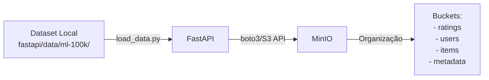

# 🎬 Sistema de Recomendação de Filmes - MovieLens

[](https://www.python.org/)
[](https://fastapi.tiangolo.com/)
[](https://www.docker.com/)
[](LICENSE)

## 📚 Informações Acadêmicas

**Disciplina:** Aprendizado de Máquina - 2025.2  
**Instituição:** CESAR School

## 👥 Equipe do Projeto

- **[Seu Nome Completo]** - [@seu-usuario-github](https://github.com/seu-usuario)

> 💡 **Nota:** Adicione aqui o nome completo e o usuário GitHub de todos os membros da equipe.

---

## 📋 Sobre o Projeto

Este projeto implementa um **sistema de recomendação de filmes** baseado em técnicas de Machine Learning, especificamente combinando:

- **K-Means Clustering** - para agrupar filmes similares
- **K-Nearest Neighbor (KNN)** - para fazer recomendações personalizadas

O pipeline completo integra as seguintes tecnologias em uma arquitetura de microserviços:

```
┌─────────────┐    ┌─────────┐    ┌──────────────┐    ┌─────────┐    ┌────────────────┐
│   FastAPI   │───▶│  MinIO  │───▶│  Snowflake   │───▶│ MLFlow  │───▶│  ThingsBoard   │
│  (Ingestão) │    │  (S3)   │    │ (Estrutura)  │    │(Tracking)│   │(Visualização)  │
└─────────────┘    └─────────┘    └──────────────┘    └─────────┘    └────────────────┘
```

### Dataset

Utilizamos o **MovieLens 100K Dataset**, que contém:

- 📊 100.000 avaliações (1-5 estrelas)
- 👥 943 usuários
- 🎬 1.682 filmes
- 📝 Informações demográficas dos usuários

---

## 🚀 Instruções Detalhadas - Levantar a Infraestrutura

### Pré-requisitos

Certifique-se de ter instalado:

- **Docker Desktop** (versão 20.10 ou superior)
- **Docker Compose** (versão 2.0 ou superior)
- **Git** (para clonar o repositório)
- **Python 3.11+** (opcional, apenas se quiser rodar localmente sem Docker)

### Passo 1: Clonar o Repositório

```bash
git clone https://github.com/SEU-USUARIO/movie-recommender-ml.git
cd movie-recommender-ml
```

### Passo 2: Preparar o Dataset MovieLens

1. Baixe o dataset [MovieLens 100K](https://files.grouplens.org/datasets/movielens/ml-100k.zip)
2. Extraia o conteúdo do arquivo `.zip`
3. Copie a pasta `ml-100k/` para dentro do diretório `fastapi/data/` do projeto:

```bash
# Linux/Mac
mkdir -p fastapi/data
cp -r /caminho/para/ml-100k fastapi/data/

# Windows PowerShell
New-Item -ItemType Directory -Force -Path fastapi\data
Copy-Item -Recurse C:\caminho\para\ml-100k fastapi\data\
```

Estrutura esperada:

```
projeto/
└── fastapi/
    └── data/
        └── ml-100k/
            ├── u.data
            ├── u.user
            ├── u.item
            ├── u.genre
            └── ...
```

### Passo 3: Levantar a Infraestrutura

Execute o comando abaixo para iniciar **todos os serviços** (MinIO, PostgreSQL, FastAPI, JupyterLab, MLFlow):

```bash
docker-compose up -d
```

**Saída esperada:**

```
[+] Running 6/6
 ✔ Network movielens_network         Created
 ✔ Container movielens_minio         Started
 ✔ Container movielens_postgres      Started
 ✔ Container movielens_fastapi       Started
 ✔ Container movielens_jupyterlab    Started
 ✔ Container movielens_mlflow        Started
 ✔ Container movielens_thingsboard   Started
```

### Passo 4: Verificar Status dos Containers

```bash
docker-compose ps
```

**Saída esperada:**

```
NAME                    STATUS       PORTS
movielens_fastapi       Up           0.0.0.0:8000->8000/tcp
movielens_minio         Up           0.0.0.0:9000-9001->9000-9001/tcp
movielens_postgres      Up           0.0.0.0:5438->5432/tcp
movielens_jupyterlab    Up           0.0.0.0:8888->8888/tcp
movielens_mlflow        Up           0.0.0.0:5001->5000/tcp
movielens_thingsboard   Up           0.0.0.0:9090->9090/tcp
```

### Passo 5: Carregar Dados no MinIO (S3)

Execute o script de ingestão via API:

```bash
curl -X POST http://localhost:8000/ingest/movielens
```

**Ou** entre no container e execute manualmente:

```bash
docker-compose exec fastapi python load_data.py
```

**Verificar no console MinIO:**

- Acesse: http://localhost:9001
- Login: `projeto_ml_admin` / `cavalo-nimbus-xbox`
- Verifique o bucket `movielens-data`

### Passo 6: Executar ETL para PostgreSQL

Transfira os dados do MinIO para o PostgreSQL:

```bash
docker-compose exec fastapi python etl_minio_postgres.py
```

**Ou via API:**

```bash
curl -X POST http://localhost:8000/etl/run
```

### Passo 7: Acessar o JupyterLab

1. Acesse: http://localhost:8888
2. Não precisa de senha (acesso direto)
3. Abra o notebook: `notebooks/parte3_analise_modelagem.ipynb`
4. Execute as células sequencialmente para:
   - Conectar ao PostgreSQL
   - Realizar análise exploratória (EDA)
   - Treinar modelos (K-Means + KNN)
   - Avaliar resultados com RMSE, Precision@K, Recall@K

### Passo 8: Visualizar Experimentos no MLFlow

1. Acesse: http://localhost:5001
2. Navegue pelos experimentos registrados
3. Compare métricas entre diferentes modelos

### Passo 9: Visualizar Dashboard ThingsBoard

1. **Subir o ThingsBoard:**
```bash
docker-compose up -d thingsboard
```

2. **Aguardar inicialização** (30-60 segundos)

3. **Acessar interface:**
   - URL: http://localhost:9090
   - Usuário: `tenant@thingsboard.org`
   - Senha: `tenant`

4. **Sincronizar dados:**
```bash
docker-compose exec fastapi python thingsboard_client.py
docker-compose exec fastapi python sync_models_real.py
```

5. **Importar dashboards:**
   - Vá para **Dashboards** → **+** → **Import**
   - Importe o arquivo `trendz/dashboard_movie.json`

6. **Visualizar insights:**
   - Métricas de modelos ML (RMSE comparativo)
   - Comparação entre KNN Paper, KNN Tunado e Random Forest
   - Dispersão das avaliações por faixas

---

## 🔗 Acessos aos Serviços

| Serviço               | URL                        | Credenciais                                                              |
| --------------------- | -------------------------- | ------------------------------------------------------------------------ |
| **FastAPI (Swagger)** | http://localhost:8000/docs | -                                                                        |
| **MinIO Console**     | http://localhost:9001      | User: `projeto_ml_admin`<br>Password: `cavalo-nimbus-xbox`                          |
| **PostgreSQL**        | `localhost:5438`           | User: `ml_user`<br>Password: `ml_password_2025`<br>Database: `movielens` |
| **MLFlow UI**         | http://localhost:5001      | - (Rastreamento de experimentos)                                         |
| **ThingsBoard**       | http://localhost:9090      | User: `tenant@thingsboard.org`<br>Password: `tenant`                    |

---

## 🧪 Executar o Sistema Completo

### Pipeline Completo - Passo a Passo

```bash
# 1. Levantar infraestrutura
docker-compose up -d

# 2. Aguardar serviços iniciarem (30-60 segundos)
sleep 60

# 3. Carregar dados no MinIO
curl -X POST http://localhost:8000/ingest/movielens

# 4. Transferir para PostgreSQL
curl -X POST http://localhost:8000/etl/run

# 5. Abrir JupyterLab e executar análise
# Acesse: http://localhost:8888
# Abra: notebooks/parte3_analise_modelagem.ipynb
# Execute todas as células

# 6. Visualizar resultados no MLFlow
# Acesse: http://localhost:5001

# 7. Gerar visualizações
# Acesse: reports/ para ver os plots gerados
```

---

## 📊 Visualizar o Dashboard

### Opção 1: Plots Estáticos (reports/)

Após executar o notebook de modelagem, os gráficos são salvos automaticamente em:

```
reports/
├── elbow_method_wcss.png              # Método do cotovelo (K-Means)
├── cluster_distribution.png           # Distribuição de clusters
├── eda_visualizacoes.png              # Visualizações EDA
├── eda_scatter_plots.png              # Gráficos de dispersão
├── hyperparameter_tuning_heatmap.png  # Heatmap de hiperparâmetros
├── metrics_evaluation_summary.png     # Resumo das métricas
└── random_forest_feature_importance.png # Importância das features
```

### Opção 2: Dashboard Interativo (ThingsBoard)

1. Acesse: http://localhost:9090
2. Login: `tenant@thingsboard.org` / `tenant`
3. Importe o dashboard de `trendz/dashboard_movie.json`
4. Visualize métricas:
   - Comparação de RMSE entre modelos
   - KNN Paper vs KNN Tunado vs Random Forest
   - Dispersão das avaliações

---

## 📁 Estrutura do Projeto

```
/
├── docker-compose.yml          # Orquestração dos contêineres
├── jupyterlab/                 # Ambiente de análise e exploração (Dockerfile e configs)
│   ├── Dockerfile
│   └── requirements.txt
├── mlflow/                     # Configuração e armazenamento de experimentos
│   └── Dockerfile
├── fastapi/                    # Camada de ingestão (API)
│   ├── Dockerfile
│   ├── main.py                 # Aplicação FastAPI
│   ├── minio_client.py         # Cliente MinIO/S3
│   ├── postgres_client.py      # Cliente PostgreSQL
│   ├── thingsboard_client.py   # Cliente ThingsBoard
│   ├── etl_minio_postgres.py   # ETL MinIO → PostgreSQL
│   ├── load_data.py            # Script de carga inicial
│   ├── requirements.txt
│   ├── data/                   # Dataset MovieLens
│   │   └── ml-100k/
│   └── postgres/               # Scripts SQL
│       └── init.sql
├── notebooks/                  # Notebooks de tratamento, visualização e modelagem
│   └── parte3_analise_modelagem.ipynb
├── trendz/                     # Dashboards exportados
├── reports/                    # Figuras com os plots dos resultados
├── README.md                   # Descrição do projeto
└── LICENSE                     # Licença
```

---

## 🔧 Parte 1: Ingestão de Dados (Status: ✅ Completo)

### Funcionalidades Implementadas

A API FastAPI oferece os seguintes endpoints:

#### 📊 Health Check

```bash
GET /health
```

Verifica status da API e conexão com MinIO

#### 📤 Upload de Arquivo

```bash
POST /upload
```

Faz upload de arquivo individual para o MinIO

**Exemplo:**

```bash
curl -X POST "http://localhost:8000/upload?folder=raw" \
  -F "file=@caminho/para/arquivo.csv"
```

#### 📋 Listar Arquivos

```bash
GET /files?prefix=movielens/
```

Lista todos os arquivos no bucket

#### 📥 Download de Arquivo

```bash
GET /download/{caminho-do-arquivo}
```

#### 🗑️ Deletar Arquivo

```bash
DELETE /files/{caminho-do-arquivo}
```

#### 🎬 Ingestão Completa do MovieLens

```bash
POST /ingest/movielens
```

Carrega todo o dataset MovieLens para o MinIO automaticamente

---

## 📊 Fluxo de Dados - Parte 1



### Estrutura no MinIO

Os dados são organizados da seguinte forma no bucket `movielens-data`:

```
movielens-data/
├── movielens/
│   ├── ratings/
│   │   └── u.data              # 100k avaliações
│   ├── users/
│   │   └── u.user              # Dados demográficos
│   ├── items/
│   │   └── u.item              # Informações dos filmes
│   └── metadata/
│       ├── u.genre             # Gêneros
│       ├── u.occupation        # Profissões
│       └── u.info              # Informações gerais
```

---

## 🧪 Testando a API

### 1. Via Swagger UI (Recomendado)

Acesse: http://localhost:8000/docs

Interface interativa para testar todos os endpoints.

### 2. Via cURL

```bash
# Health check
curl http://localhost:8000/health

# Listar arquivos
curl http://localhost:8000/files

# Ingestão completa
curl -X POST http://localhost:8000/ingest/movielens
```

### 3. Via Python

```python
import requests

# Health check
response = requests.get("http://localhost:8000/health")
print(response.json())

# Ingestão
response = requests.post("http://localhost:8000/ingest/movielens")
print(response.json())
```

---

## 🐛 Troubleshooting

### Problema: Containers não iniciam

```bash
# Verificar logs
docker-compose logs fastapi
docker-compose logs minio

# Recriar containers
docker-compose down
docker-compose up -d --build
```

### Problema: MinIO não conecta

1. Verifique se o MinIO está rodando:

```bash
docker-compose ps minio
```

2. Teste conexão direta:

```bash
curl http://localhost:9000/minio/health/live
```

3. Acesse o console: http://localhost:9001

### Problema: Erro ao fazer upload

Verifique as permissões do diretório de dados:

```bash
# No Linux/Mac
chmod -R 755 fastapi/data/

# Ou monte o volume com permissões corretas no docker-compose.yml
```

---

## 🔬 MLflow - Rastreamento de Experimentos

### O que é MLflow?

MLflow é uma plataforma open-source para gerenciar o ciclo de vida completo de Machine Learning, incluindo:
- **Tracking:** Registro de parâmetros, métricas e artifacts
- **Models:** Versionamento e deployment de modelos
- **Projects:** Reprodutibilidade de experimentos

### Como usar no projeto

1. **Iniciar serviços:**
```powershell
docker-compose up -d
```

2. **Configurar bucket MLflow (primeira vez):**
```bash
docker-compose exec fastapi python create_mlflow_bucket.py
```

3. **Acessar interface:**
- MLflow UI: http://localhost:5001

4. **No notebook Jupyter:**
```python
import mlflow
mlflow.set_tracking_uri("http://localhost:5001")
mlflow.set_experiment("MovieLens_Recommender")

with mlflow.start_run(run_name="meu_experimento"):
    mlflow.log_param("k_clusters", 5)
    mlflow.log_metric("rmse", 1.23)
    mlflow.sklearn.log_model(model, "kmeans_model")
```

5. **Consultar experimentos:**
```python
# Ver todos os runs
runs = mlflow.search_runs()

# Carregar modelo salvo
model = mlflow.sklearn.load_model("runs:/<run_id>/model")
```

### Arquitetura do MLflow

```
MLflow Tracking Server (http://localhost:5001)
├── Backend Store: PostgreSQL (metadata)
├── Artifact Store: MinIO S3 (modelos e arquivos)
└── UI: Interface web para visualização
```

---

## 📝 Próximas Etapas

- [x] **Parte 1:** Ingestão de dados (FastAPI + MinIO) ✅
- [x] **Parte 2:** ETL MinIO → PostgreSQL ✅
- [x] **Parte 3:** Análise exploratória e modelagem ✅
- [x] **Parte 4:** MLflow - Rastreamento de experimentos ✅
- [x] **Parte 5:** Dashboard e visualização (ThingsBoard) ✅

---

## 📚 Documentação Adicional

- [FastAPI Docs](https://fastapi.tiangolo.com/)
- [MinIO Docs](https://min.io/docs/minio/linux/index.html)
- [MovieLens Dataset](https://grouplens.org/datasets/movielens/100k/)
- [Paper Original](https://doi.org/10.1109/CONFLUENCE.2019.8776969)

---

## 📄 Licença

Este projeto está sob a licença MIT. Veja o arquivo [LICENSE](LICENSE) para mais detalhes.

---

## 🤝 Contribuindo

Contribuições são bem-vindas! Por favor:

1. Faça um Fork do projeto
2. Crie uma branch para sua feature (`git checkout -b feature/MinhaFeature`)
3. Commit suas mudanças (`git commit -m 'Adiciona MinhaFeature'`)
4. Push para a branch (`git push origin feature/MinhaFeature`)
5. Abra um Pull Request

---

## 📧 Contato

**CESAR School** - Aprendizado de Máquina 2025.2

Para dúvidas ou sugestões, abra uma [issue](https://github.com/seu-usuario/movie-recommender-ml/issues).

---

<div align="center">

**Desenvolvido com ❤️ para a disciplina de Aprendizado de Máquina**

</div>
